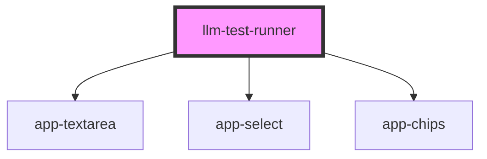

# llm-test-runner

<!-- Auto Generated Below -->

## Properties

| Property                       | Attribute  | Description | Type                                                                                                                                                                                                                                                                                                                                                                                                                                                                                                                                                                                                                                                                                          | Default     |
| ------------------------------ | ---------- | ----------- | --------------------------------------------------------------------------------------------------------------------------------------------------------------------------------------------------------------------------------------------------------------------------------------------------------------------------------------------------------------------------------------------------------------------------------------------------------------------------------------------------------------------------------------------------------------------------------------------------------------------------------------------------------------------------------------------- | ----------- |
| `defaultExpectedOutcomeSchema` | --         |             | `({ label: string; type: "text"; required?: boolean; placeholder?: string; } \| { label: string; type: "textarea"; required?: boolean; placeholder?: string; rows?: number; } \| { label: string; type: "chips-input"; required?: boolean; placeholder?: string; } \| { label: string; type: "select"; options: string[]; required?: boolean; placeholder?: string; })[]`                                                                                                                                                                                                                                                                                                                     | `undefined` |
| `delayMs`                      | `delay-ms` |             | `number`                                                                                                                                                                                                                                                                                                                                                                                                                                                                                                                                                                                                                                                                                      | `500`       |
| `initialTestCases`             | --         |             | `{ id: string; question: string; expectedOutcome: ({ label: string; type: "text"; value: string; required?: boolean; placeholder?: string; } \| { label: string; type: "textarea"; value: string; required?: boolean; placeholder?: string; rows?: number; } \| { label: string; type: "chips-input"; value: string[]; required?: boolean; placeholder?: string; } \| { label: string; type: "select"; options: string[]; value: string; required?: boolean; placeholder?: string; })[]; evaluationParameters?: { approach: EvaluationApproach; threshold?: number; }; output?: string; isRunning?: boolean; error?: string; evaluationResult?: EvaluationResult; responseTime?: number; }[]` | `undefined` |
| `useSave`                      | `use-save` |             | `boolean`                                                                                                                                                                                                                                                                                                                                                                                                                                                                                                                                                                                                                                                                                     | `false`     |

## Events

| Event        | Description | Type                             |
| ------------ | ----------- | -------------------------------- |
| `llmRequest` |             | `CustomEvent<LLMRequestPayload>` |
| `save`       |             | `CustomEvent<SavePayload>`       |

## Methods

### `resetSavingState() => Promise<void>`

#### Returns

Type: `Promise<void>`

## Dependencies

### Depends on

- [app-textarea](../../lib/form/components)
- [app-select](../../lib/form/components)
- [app-chips](../../lib/form/components)

### Graph

----------------------------------------------

*Built with [StencilJS](https://stenciljs.com/)*
