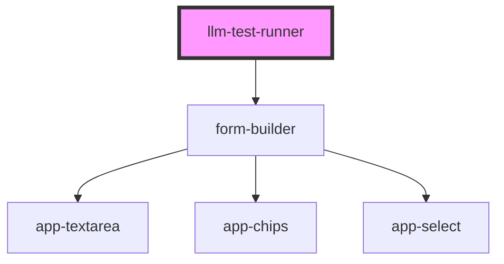

# llm-test-runner

<!-- Auto Generated Below -->

## Properties

| Property           | Attribute  | Description | Type         | Default     |
| ------------------ | ---------- | ----------- | ------------ | ----------- |
| `delayMs`          | `delay-ms` |             | `number`     | `500`       |
| `initialTestCases` | --         |             | `TestCase[]` | `undefined` |
| `useSave`          | `use-save` |             | `boolean`    | `false`     |

## Events

| Event        | Description | Type                             |
| ------------ | ----------- | -------------------------------- |
| `llmRequest` |             | `CustomEvent<LLMRequestPayload>` |
| `save`       |             | `CustomEvent<SavePayload>`       |

## Methods

### `resetSavingState() => Promise<void>`

#### Returns

Type: `Promise<void>`

## Dependencies

### Depends on

- [form-builder](../../lib/form)

### Graph

----------------------------------------------

*Built with [StencilJS](https://stenciljs.com/)*
