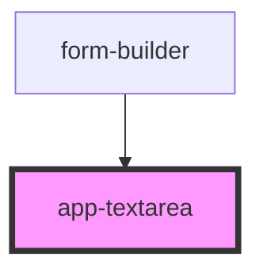

# app-textarea

<!-- Auto Generated Below -->

## Properties

| Property     | Attribute      | Description | Type             | Default     |
| ------------ | -------------- | ----------- | ---------------- | ----------- |
| `config`     | --             |             | `TextAreaConfig` | `undefined` |
| `testCaseId` | `test-case-id` |             | `string`         | `undefined` |
| `value`      | `value`        |             | `string`         | `undefined` |

## Events

| Event         | Description | Type                                                               |
| ------------- | ----------- | ------------------------------------------------------------------ |
| `valueChange` |             | `CustomEvent<{ key: string; value: string; testCaseId: string; }>` |

## Dependencies

### Used by

 - [form-builder](..)

### Graph

----------------------------------------------

*Built with [StencilJS](https://stenciljs.com/)*
