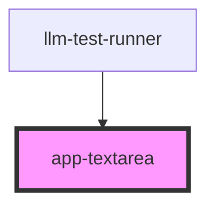

# app-textarea

<!-- Auto Generated Below -->

## Properties

| Property | Attribute | Description | Type             | Default     |
| -------- | --------- | ----------- | ---------------- | ----------- |
| `config` | --        |             | `TextAreaConfig` | `undefined` |
| `value`  | `value`   |             | `string`         | `undefined` |

## Events

| Event         | Description | Type                              |
| ------------- | ----------- | --------------------------------- |
| `valueChange` |             | `CustomEvent<{ value: string; }>` |

## Dependencies

### Used by

 - [llm-test-runner](../../../components/llm-test-runner)

### Graph

----------------------------------------------

*Built with [StencilJS](https://stenciljs.com/)*
