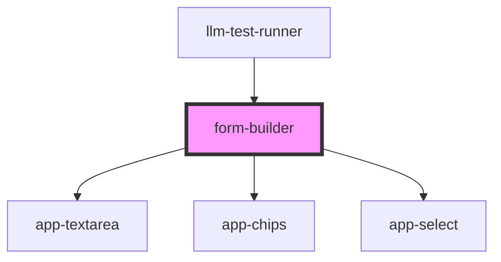

# form-builder

<!-- Auto Generated Below -->

## Properties

| Property               | Attribute | Description | Type                                                                            | Default     |
| ---------------------- | --------- | ----------- | ------------------------------------------------------------------------------- | ----------- |
| `addChip`              | --        |             | `(e: CustomEvent<{ testCaseId: string; key: string; value: string; }>) => void` | `undefined` |
| `fields`               | --        |             | `FieldConfig[]`                                                                 | `[]`        |
| `handleTestCaseChange` | --        |             | `(e: CustomEvent<{ testCaseId: string; key: string; value: string; }>) => void` | `undefined` |
| `onUpdateApproach`     | --        |             | `(testCase: TestCase, approach: any) => void`                                   | `undefined` |
| `removeChip`           | --        |             | `(e: CustomEvent<{ testCaseId: string; key: string; index: number; }>) => void` | `undefined` |
| `testCase`             | --        |             | `TestCase`                                                                      | `undefined` |

## Dependencies

### Used by

 - [llm-test-runner](../../components/llm-test-runner)

### Depends on

- [app-textarea](components)
- [app-chips](components)
- [app-select](components)

### Graph

----------------------------------------------

*Built with [StencilJS](https://stenciljs.com/)*
